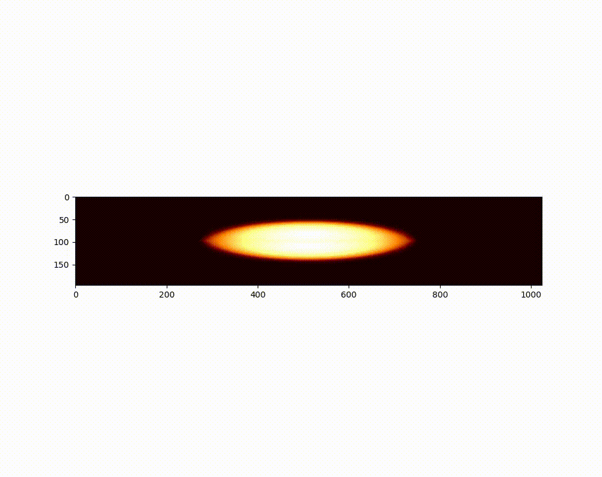

# time-crystal-simulation

Simulations of time-crystal evolution. Originally written in C / MATLAB by J. Smits; here adapted and Pythonised.

## What’s inside

- Core simulation code (C) for the time-crystal dynamics  
- A simple Python helper for setup / analysis  
- Example outputs: simulation movies (`simulations.mov`, `simulations2.mov`, `simulations_short.mov`)  

## Quick start
Run the simulation:

- Use the C binary or compile from `main_forlei.c`  
- Optionally use the Python interface for parameter sweeps or data handling  

Output movies will appear in the repository root.  

## Preview  

Video of a sample simulation:  

  

(Click to view full motion — shows the time-crystal behavior over simulated time.)  

## Notes

This repo captures a minimal simulation environment. It’s ideal for testing parameter regimes, visualizing time-crystal formation, or building on top of the existing codebase for further research.

